# itelect2-project
My IT Elective 2 backend web development project.

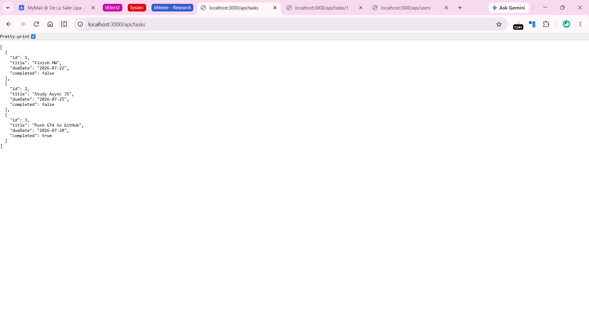

## API Testing

### GET /api/tasks
http://localhost:3000/api/tasks
)

### POST /api/tasks
)

### PUT /api/tasks/:id
)

### DELETE /api/tasks/:id
)

## GT7 & 8

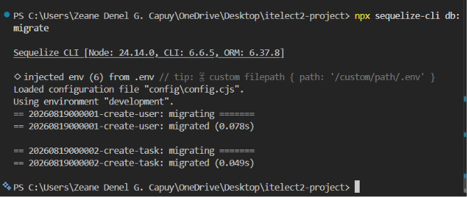

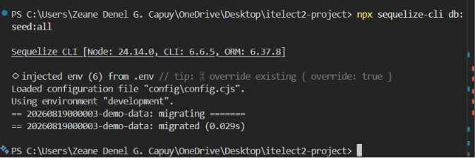

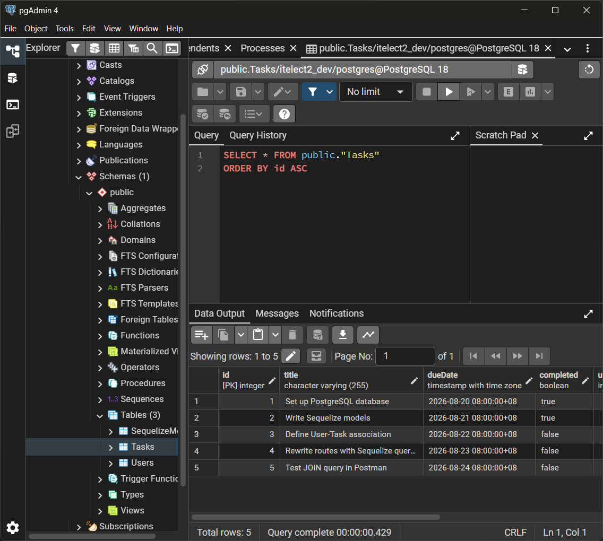

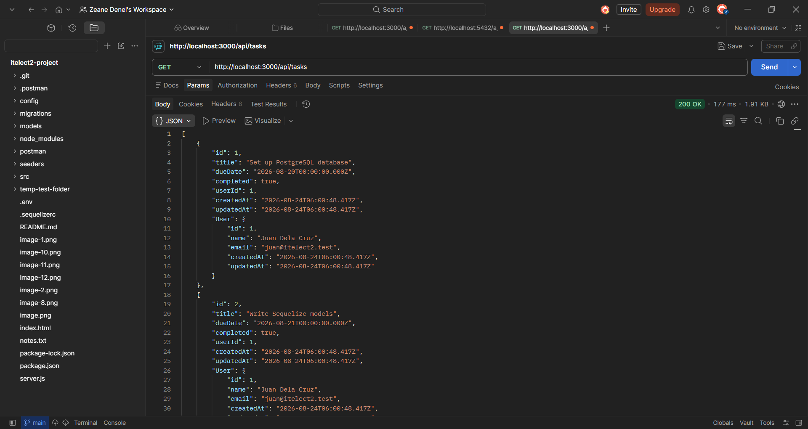

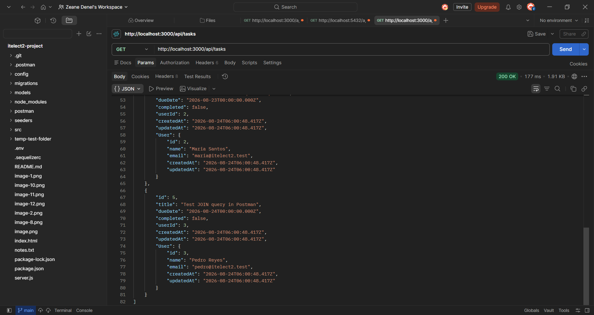

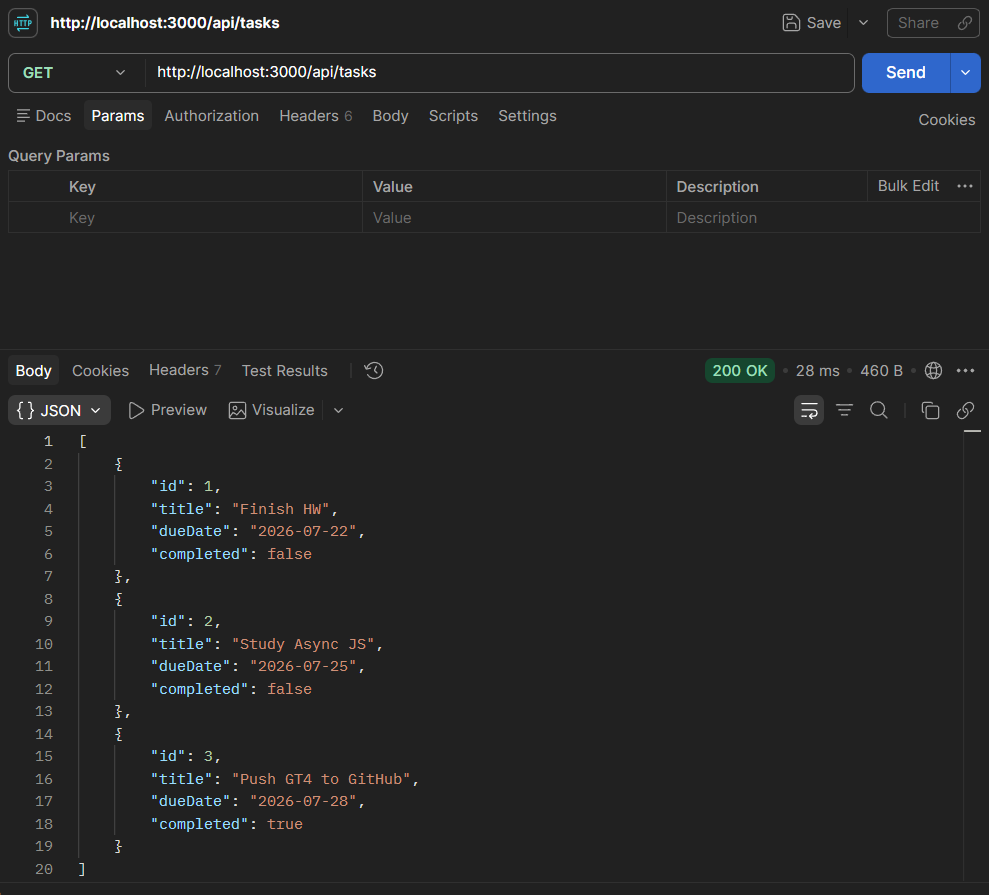

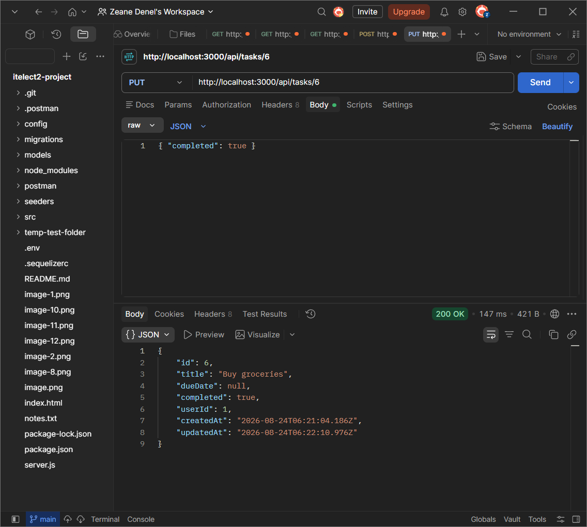

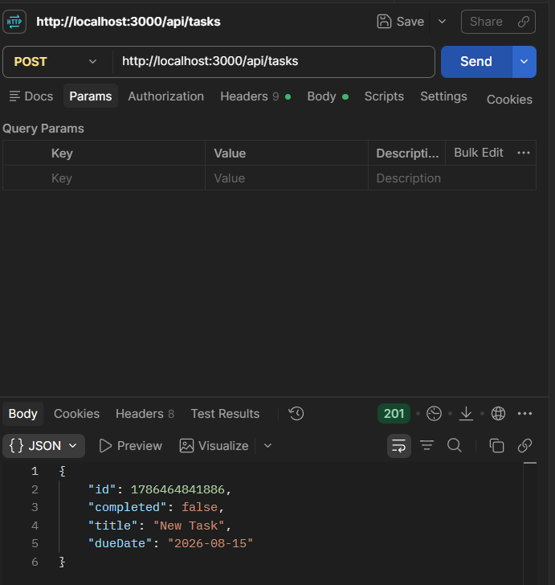

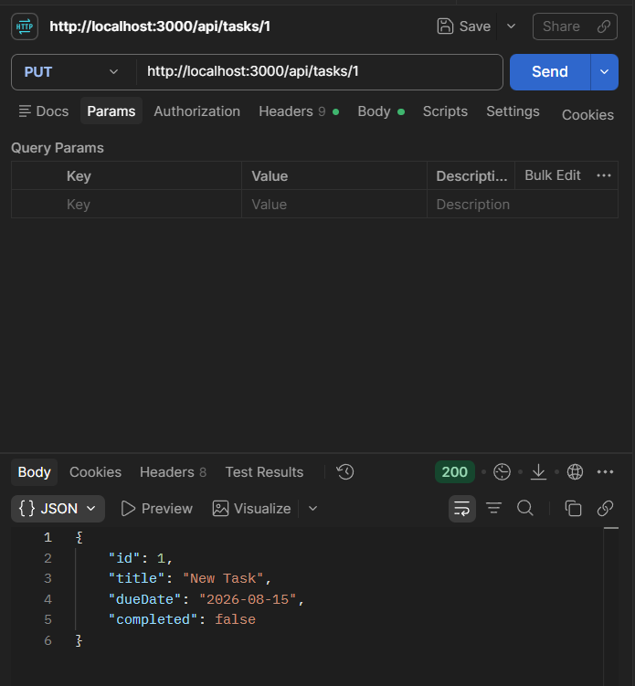

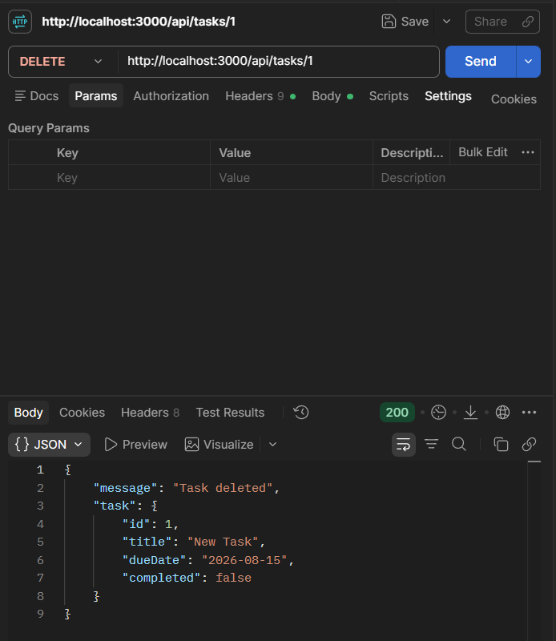

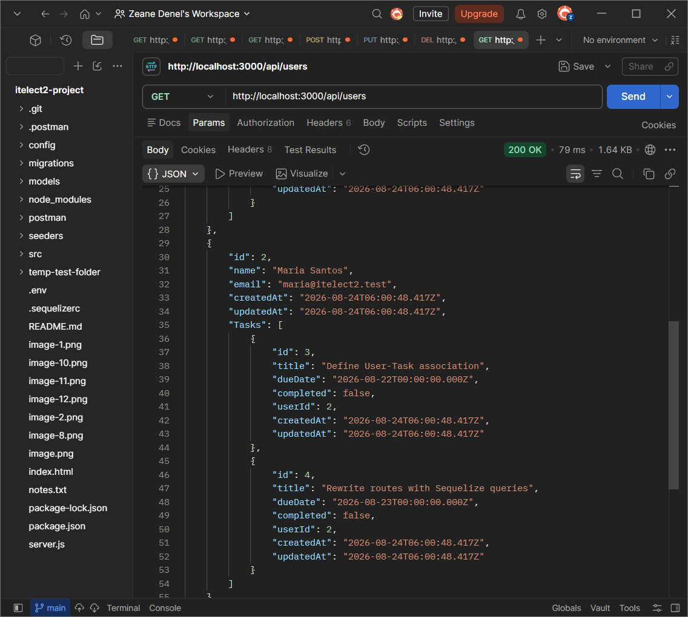

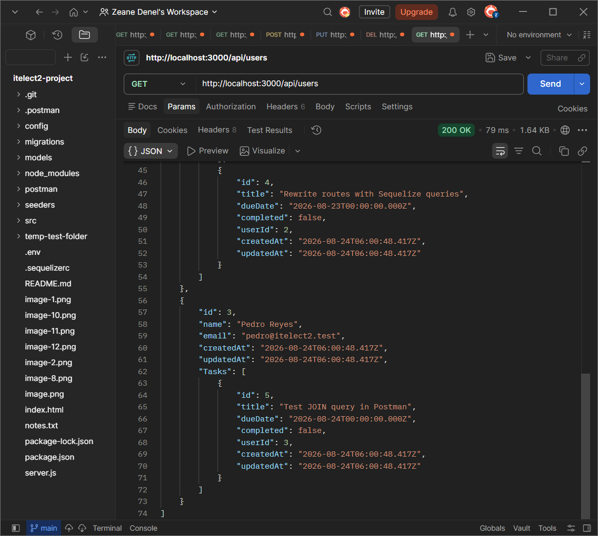